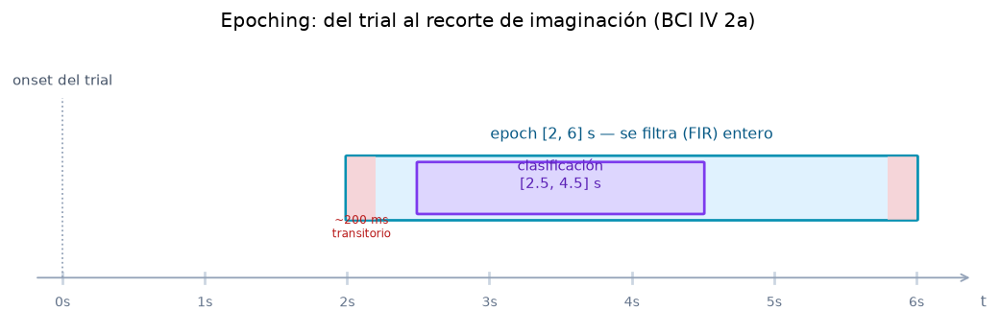

# 1 · Datos: datasets, carga y epoching

> De dónde sale la señal, cómo se carga y cómo se trocea en *trials* antes de tocar el
> pipeline LTI. Todo verificado contra `configs/*.yaml`, `backend/src/bci/datasets/moabb_loader.py`
> y el `REGISTRY` de `backend/src/bci/server/app.py`.

---

## 1.1 Qué datasets usamos

No hay hardware: la señal viene de **datasets EEG públicos** de imaginación motora, cargados con
**MOABB** (que a su vez usa MNE). El catálogo final son **3 datasets**, todos de imaginación
motora **izquierda vs. derecha** y con **≥ 2 sesiones** reales (días distintos):

| id (MOABB) | Etiqueta | `fs` | Canales | Sujetos | Sesiones | Notas |
|---|---|---|---|---|---|---|
| `BNCI2014_001` | **BCI IV 2a** | 250 Hz | 22 | 9 | 2 | El de referencia; cue 2–6 s. |
| `BNCI2014_004` | **BCI IV 2b** | 250 Hz | **3** (C3, Cz, C4) | 9 | 5 | Ligero; CSP de solo 2 componentes. |
| `Kumar2024` | **Kumar2024** | **512 Hz** | 22 | 18 | 6 | Descarga pesada (ZIP 4,47 GB), `fs` distinto. |

Esta diversidad es **deliberada** y sirve para la defensa: tres `fs`/montajes distintos (250 vs
512 Hz; 3 vs 22 canales) demuestran que el **mismo** pipeline LTI se adapta sin cambios (ver 1.5).

> **Decisión técnica (por qué estos y no otros).** El criterio dominante es **≥ 2 sesiones**:
> permite la estimación **honesta inter-sesión** (calibrar en la sesión 1, probar en la 2), que es
> lo que de verdad importa para una demo "en vivo" realista. Datasets de 1 sola sesión quedan fuera
> para ese uso. La viabilidad de cualquier dataset de MOABB se comprueba **empíricamente** con
> `scripts/probe_dataset.py` (los metadatos a veces mienten: p. ej. Lee2019_MI declara 2 sesiones
> pero MOABB 1.5.0 solo expone 1).

> **Decisión técnica (cada dataset es autosuficiente).** Un plan anterior juntaba muchos datasets
> en un solo *pool* cross-dataset (remuestreando todo a un `fs` común con PhysioNet/Dreyer/Cho).
> **Se abandonó.** Hoy cada dataset se evalúa **por separado** con sus 4 regímenes
> (within/cross × CSP/EEGNet, ver [sección 6](06-validacion-resultados.md)). Por eso **no hay
> PhysioNet ni pooling cross-dataset**: `dsp/resampling.py` sigue existiendo (lo usa la sonda
> `probe_dataset.py` y comparte el FIR anti-aliasing), pero el entrenamiento cross-dataset ya no.

---

## 1.2 La carga: señal CRUDA, sin filtrar

El cargador `backend/src/bci/datasets/moabb_loader.py` descarga y epoca, devolviendo un
`EpochedData`:

| Campo | Qué es |
|---|---|
| `X` | señal **cruda** (sin filtrar), forma `(n_trials, n_canales, n_muestras)` |
| `y` | etiqueta de clase por trial (strings: `left_hand` / `right_hand`) |
| `metadata` | `subject`, `session`, `run` por trial — **imprescindible** para validar separando por sesión |
| `ch_names` | nombres de canal, en el orden del eje 1 de `X` |
| `sfreq` | frecuencia de muestreo (Hz) |

> **Decisión central (LTI).** El loader **no aplica ningún filtro de frecuencia**: entrega la señal
> cruda **a propósito**. Filtrar es justo lo que queremos hacer **a mano** después (el FIR de la
> [sección 2](02-fir-convolucion.md)), no esconderlo en la carga. `picks="eeg"` descarta canales
> EOG/STIM y `baseline=null` significa **sin** corrección de línea base (señal tal cual).

La descarga es **robusta sujeto a sujeto** (reintentos + timeout largo): si un sujeto da
*read-timeout* (típico de OSF/Zenodo), se omite y se continúa, en vez de tirar toda la corrida.

---

## 1.3 El epoching: del trial al recorte de imaginación

Cada dataset marca *cuándo* aparece el cue de imaginación. El epoching corta una ventana relativa
al **onset del trial** (parámetros `epoching.tmin/tmax` del YAML), y luego una **sub-ventana de
clasificación** (`classification_window.tmin_rel/tmax_rel`) que se queda con la fase más
discriminativa:

| Dataset | epoch `[tmin, tmax]` | ventana de clasificación (relativa al epoch) |
|---|---|---|
| 2a | `[2, 6]` s | `[0.5, 2.5]` s → 2.5–4.5 s del trial |
| 2b | `[3, 7.5]` s | `[0.5, 2.5]` s |
| Kumar | `[0, 5]` s | `[0.5, 2.5]` s |

> **Decisión técnica: "filtrar entero y recortar después".** El FIR se aplica al **epoch completo**
> y *luego* se recorta a la ventana de clasificación. Esto logra dos cosas: (1) descarta el
> **transitorio de borde** del FIR (≈ retardo de grupo, ~200 ms; zonas rojas de la figura) y
> (2) se queda con la sub-ventana más separable. Medido inter-sesión (sujeto 1, 2a): usar todo el
> epoch `[2,6]` da 0.52 de accuracy; recortar a `[2.5,4.5]` sube a 0.74. La ventana de
> clasificación (0.5 s tras el cue) empieza **después** del transitorio (~0.2 s), así que no lo "ve".

---

## 1.4 `fs` dinámico (teoría de muestreo)

El pipeline detecta la **frecuencia de muestreo real** de cada dataset desde los epochs, en lugar
de hardcodearla. Así un mismo `MotorImageryPipeline` sirve para 250 Hz (2a/2b) y 512 Hz (Kumar).
La consecuencia LTI más visible está en el FIR: el nº de coeficientes (`num_taps`) se **escala con
`fs`** para mantener una duración temporal similar del filtro (~0,4 s):

| Dataset | `fs` | `num_taps` | duración del FIR |
|---|---|---|---|
| 2a / 2b | 250 Hz | 101 | (101−1)/250 ≈ 0,40 s |
| Kumar | 512 Hz | 205 | (205−1)/512 ≈ 0,40 s |

> Más muestras por segundo ⇒ más coeficientes para "cubrir" el mismo tiempo y conseguir la misma
> selectividad en frecuencia. El detalle del diseño del FIR está en la [sección 2](02-fir-convolucion.md).

---

## 1.5 Scripts de datos

| Script | Qué hace |
|---|---|
| `scripts/download_data.py` | Carga la señal cruda y la epoca con nuestro loader; valida (opcional) que el epoching coincide con el *Paradigm* de MOABB; con `--save` cachea `X/y` en `data/processed/<id>_s<n>.npz`. |
| `scripts/setup_data.py` | Pre-descarga **todos** los sujetos de un dataset de una vez (máquina nueva): calienta la caché de MNE sujeto a sujeto, tolerando fallos. |
| `scripts/probe_dataset.py` | **Sonda de viabilidad**: para cualquier dataset de MOABB comprueba *empíricamente* (descargando 1 sujeto) si sirve para el proyecto (≥2 sesiones reales, clases izq./der., carga OK). |

> Estas figuras del informe se generan justamente desde esa caché local
> (`data/processed/BNCI2014_001_s1.npz`) con `scripts/make_report_figures.py`, sin volver a
> descargar nada (ver [sección 9](09-scripts-y-uso.md)).

---

## 1.6 Cómo se representa en la página

- **Selector de datos** (en *Entrenamiento*, `DataSelector` de `SpatialCSP.tsx`): elige dataset y
  sujeto; el conteo de sujetos sale del `REGISTRY`.
- **Ficha "Información del dataset y preprocesamiento"** (`ConfigFicha`, vía `/api/train_config`):
  muestra dataset, clases, nº de canales, `fs`, nº de trials y todo el preprocesamiento (banda FIR,
  taps, ventana, retardo de grupo, ventana de clasificación, componentes CSP, shrinkage). Es la
  materialización en la web de casi todo lo de esta sección.
- **Resultados** lista los 3 datasets; los de ≥2 sesiones se destacan como aptos para la demo en
  vivo (`DatasetRolesNote`). Todos cuentan como benchmark de población.

---

**Siguiente:** [2 · FIR y convolución](02-fir-convolucion.md) — cómo se diseña y aplica el filtro
pasa-banda µ/β, la operación MAC y la respuesta en frecuencia (la teoría LTI explícita).
