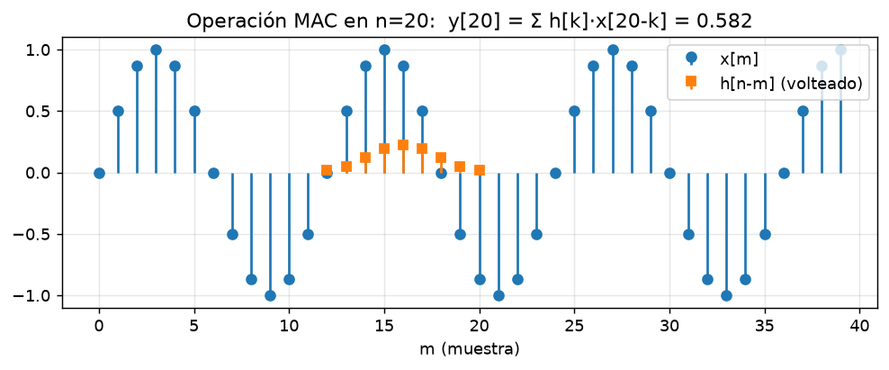
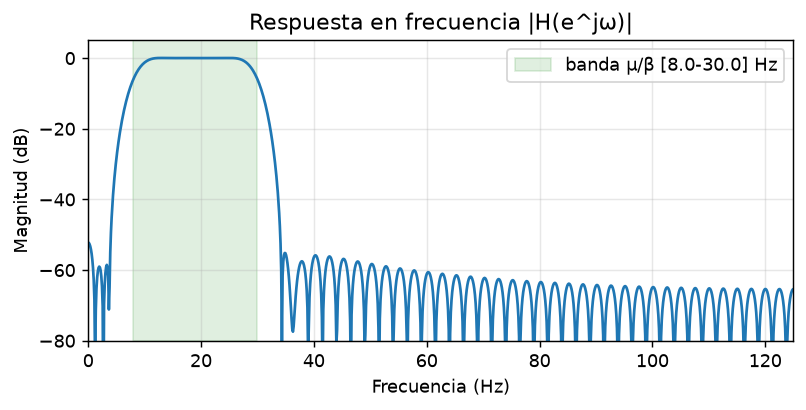
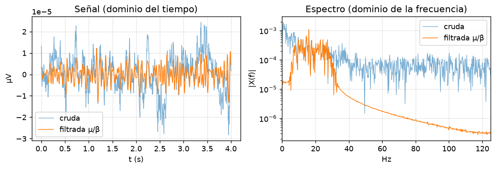

# 2 · FIR y convolución — la teoría LTI explícita

> El corazón académico del proyecto. Aquí se ve, con las fórmulas exactas del código, cómo
> diseñamos a mano un filtro FIR pasa-banda y cómo se aplica por **convolución discreta**.
> Código: `backend/src/bci/dsp/fir_filters.py`, `convolution.py`, `frequency_response.py`.
> Página: **Laboratorio** (`frontend/src/pages/SignalLab.tsx`).

---

## 2.1 Por qué un pasa-banda µ/β (8–30 Hz)

La imaginación motora se refleja en los **ritmos sensoriomotores**: las bandas **µ (8–12 Hz)** y
**β (12–30 Hz)**. Al imaginar un movimiento, la potencia de estos ritmos **cae** sobre la corteza
motora contraria (fenómeno **ERD**, *event-related desynchronization*). Todo lo demás —deriva lenta
de la línea base (sudor, movimiento), ruido muscular y de red en alta frecuencia— es estorbo.

Por eso la **primera etapa** del pipeline es un **filtro pasa-banda FIR** que deja pasar 8–30 Hz y
atenúa el resto. Es un sistema **LTI**: queda descrito por su respuesta al impulso `h[n]`, y filtrar
es **convolucionar** la señal con `h[n]`.

---

## 2.2 Diseño del filtro: *windowed-sinc*

`design_bandpass_fir(low_hz, high_hz, fs, num_taps, window)` construye `h[n]` en tres pasos
(método de **ventaneo**):

1. **Filtro ideal.** Un pasa-banda ideal es la diferencia de dos pasa-bajos ideales; su respuesta
   al impulso es una diferencia de *sinc* (centrada en `m = n − (N−1)/2` para que salga simétrica):

   ```
   h_ideal[m] = 2·f2·sinc(2·f2·m) − 2·f1·sinc(2·f1·m)
   ```

   con las frecuencias normalizadas a la de muestreo: `f1 = low_hz/fs`, `f2 = high_hz/fs`. El *sinc*
   ideal es **infinito y no causal**.

2. **Truncar** a `N = num_taps` coeficientes (esto introduce rizado: el fenómeno de **Gibbs**).

3. **Ventanear**: multiplicar por una ventana suave que lleva los extremos a cero y reduce los
   lóbulos laterales (a cambio de una transición algo más ancha). Por defecto **Hamming**:

   ```
   w[n] = 0.54 − 0.46·cos(2πn/(N−1))
   ```

Finalmente se **normaliza** para que la ganancia sea ≈ 1 en el centro de la banda. Las ventanas
(`hamming`, `hann`, `blackman`, `rectangular`) están implementadas a mano para que la fórmula sea
explícita.

> **Decisión técnica: `num_taps` impar ⇒ fase lineal.** Como `h[n]` queda **simétrico**, el filtro
> tiene **fase lineal**: retarda todas las frecuencias **lo mismo**, sin distorsionar la forma de la
> onda. El retardo es constante e igual a `(N−1)/2` muestras (ver 2.5). Se exige `num_taps` impar
> (tipo I) y `0 < low < high < fs/2` (**Nyquist**).

El resultado es `h[n]` (la **respuesta al impulso** = los coeficientes / *taps*):

![Respuesta al impulso h[n]](figures/02-fir-impulse.png)

Su forma es un *sinc* enventanado, simétrico respecto al centro — justo la condición de fase lineal.

---

## 2.3 La convolución (y la operación MAC)

Una vez tenemos `h[n]`, filtrar es **convolucionar**:

```
y[n] = (x * h)[n] = Σ_k  h[k] · x[n − k]
```

Cada muestra de salida es una suma de productos `h[k]·x[n−k]`: la operación **MAC**
(*multiplicar-acumular*). `backend/src/bci/dsp/convolution.py` la implementa **a mano** de tres
formas equivalentes (verificadas contra NumPy en los tests):

| Función | Qué es | Para qué |
|---|---|---|
| `convolve_mac` | doble bucle literal `y[n]=Σ h[k]·x[n−k]` | didáctica ("como en el libro") |
| `mac_terms` | los términos `(h[k], x[n−k], producto)` de **una** salida `y[n]` | exponer la operación MAC paso a paso |
| `convolve` | vectorizada por **superposición** (`y[k:k+N] += h[k]·x`) | producción (rápida) |

`apply_filter(X, h, mode)` aplica la convolución sobre el **último eje** (el tiempo) de un tensor
`(n_trials, n_canales, n_muestras)`, que es como se filtra un dataset entero.



> **Decisión central: no usamos `scipy.signal.lfilter`.** `lfilter` resuelve una **ecuación en
> diferencias** (puede ser IIR, recursiva). Nosotros queremos la **convolución FIR explícita**,
> que es justo lo que el proyecto debe demostrar. (Además, un FIR de fase lineal no es realizable
> como IIR sin perder esa propiedad.)

---

## 2.4 Respuesta en frecuencia: qué hace el filtro

Para entender el filtro miramos su **respuesta en frecuencia**, la DTFT de `h[n]`
(`frequency_response.py`):

```
H(e^jω) = Σ_n  h[n] · e^{−jωn}        con  ω = 2π f / fs
```

`|H(e^jω)|` dice cuánto se amplifica/atenúa cada frecuencia. Para el pasa-banda µ/β esperamos
`|H| ≈ 1` entre 8–30 Hz y `≈ 0` fuera:



> **Detalle didáctico.** Se calcula por **suma directa** de la DTFT (no solo `np.fft`) para que la
> teoría sea explícita; los tests verifican que coincide con la FFT salvo error numérico. La idea
> LTI clave: **convolución en el tiempo ⇔ multiplicación en frecuencia**.

---

## 2.5 Causalidad y retardo de grupo

La fase lineal implica un **retardo de grupo constante** de `(N−1)/2` muestras (≈ 0,2 s con 101
*taps* a 250 Hz). `convolve`/`apply_filter` admiten tres **modos** (`_trim`):

| Modo | Longitud | Uso |
|---|---|---|
| `full` | `len_x + len_h − 1` | todas las superposiciones |
| `same` | `len_x` (centrado) | **offline**: compensa el retardo (usa muestras *futuras*) |
| `valid` | `len_x − len_h + 1` | solo donde `h` solapa por completo |

> **Offline vs online.** En el mundo **offline** usamos `mode='same'`: como tenemos el trial entero,
> centramos la salida y el retardo queda compensado (la señal filtrada se alinea con la cruda). En
> **vivo no se puede** mirar el futuro: el `CausalFIR` mantiene estado entre bloques y asume el
> retardo real (`mode='valid'`). Eso se trata en la [sección 7](07-streaming-en-vivo.md).

---

## 2.6 El efecto sobre la señal real

Aplicado a un trial real (2a, canal C3), el FIR limpia la deriva lenta y el ruido alto, dejando una
oscilación µ/β mucho más clara (en tiempo y en frecuencia):



---

## 2.7 Cómo se representa en la página

La página **Laboratorio** (mundo *online*, recibe la misma señal en vivo que las demás secciones)
es la materialización interactiva de esta sección:

- **Respuesta al impulso `h[n]`**: *stem plot* de los coeficientes (cambia con los *taps*).
- **Respuesta en frecuencia `|H(e^jω)|`**: con la banda µ/β sombreada en verde.
- **Cruda vs filtrada**: la señal en vivo, **filtrada en el cliente** con convolución **causal**
  (`frontend/src/lib/dsp.ts`, `convolveCausal`) usando la banda y los *taps* que elijas — eso es lo
  que hace interactivo el laboratorio.
- **Controles**: cortes inferior/superior, nº de *taps* y un indicador del **retardo de grupo**
  (`(N−1)/2` muestras ≈ ms), que sube al subir los *taps*.

> **El dilema del ingeniero (para la defensa).** Más *taps* ⇒ flancos casi verticales en `|H|`
> (filtro más selectivo) **pero** más retardo; menos *taps* ⇒ filtro suave que deja pasar más ruido
> **pero** casi sin retardo. Es el compromiso precisión espectral ↔ velocidad en tiempo real, y se
> ve moviendo el deslizador.

El backend expone el filtro vía `GET /api/filter?fs=&low=&high=&taps=` → devuelve `h`, el eje de
frecuencias, `|H|` en dB y el retardo de grupo (lo usa también la comparación con EEGNet).

---

**Siguiente:** [3 · CSP](03-csp.md) — el filtro **espacial** que combina los canales (`Z = W·X`) y
la log-varianza como característica.
