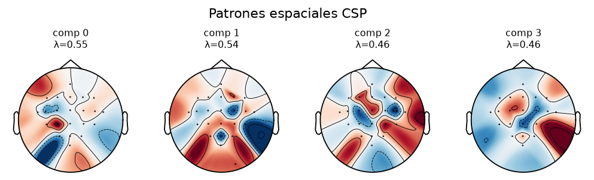
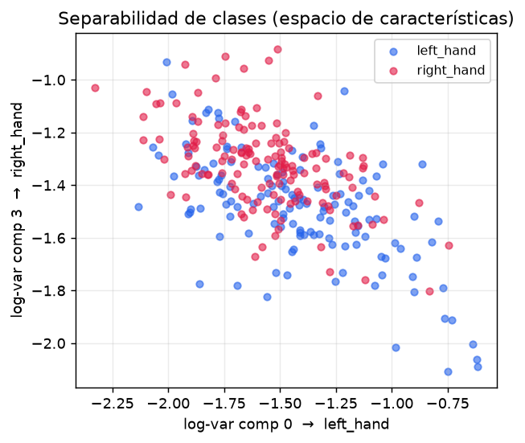

# 3 · CSP — el filtro espacial lineal

> Si el FIR es un sistema lineal en el **tiempo** (mezcla muestras vecinas), el CSP es un sistema
> lineal en el **espacio** (mezcla canales). Es la segunda etapa del pipeline y la que de verdad
> separa las clases. Código: `backend/src/bci/spatial/csp.py`, `features/log_variance.py`.
> Página: **Entrenamiento / "El Modelo"** (`frontend/src/pages/SpatialCSP.tsx`).

---

## 3.1 La idea: filtrar en el espacio, no en el tiempo

Tras el FIR, cada trial es una matriz `X` de `(n_canales, n_tiempo)`. El **CSP** (*Common Spatial
Patterns*) aplica, en **cada instante**, una combinación lineal fija de los canales:

```
z[c, n] = Σ_j  W[c, j] · x[j, n]        (en matricial:  Z = W · X)
```

donde `W` es `(n_componentes, n_canales)`. No hay convolución temporal: es una **mezcla de
electrodos** con pesos fijos. El paralelismo con el FIR es exacto y conviene subrayarlo en la
defensa:

| | FIR (sección 2) | CSP |
|---|---|---|
| Dominio | tiempo | espacio (canales) |
| Operación | `y[n] = Σ h[k]·x[n−k]` (convolución) | `z = W·x` (combinación lineal) |
| Parámetros | `h[n]` **diseñados** (fijos) | `W` **aprendidos** de los datos |

---

## 3.2 Qué optimiza el CSP

La información de la imaginación motora está en la **potencia** de los ritmos µ/β (la ERD: cae la
potencia sobre la corteza contraria a la mano imaginada). Para una señal de media cero, potencia =
**varianza**. El CSP busca las combinaciones de canales cuya **varianza sea máxima para una clase y
mínima para la otra** — es decir, las "señales virtuales" que más distinguen izquierda de derecha.

Eso lleva a un **problema de autovalores generalizados** con las covarianzas medias de cada clase
`C1`, `C2`:

```
C1 · w = λ · (C1 + C2) · w
```

Los autovalores `λ ∈ [0, 1]` **reparten** la varianza entre clases:

- `λ ≈ 1` → componente que "se enciende" (más varianza) en la **clase 0**.
- `λ ≈ 0` → componente que se enciende en la **clase 1**.
- `λ ≈ 0.5` → componente inútil (no distingue).

Por eso interesan los autovalores **extremos**.

---

## 3.3 El método de Koles (1990): whitening + diagonalización conjunta

`csp.py` resuelve el problema generalizado en pasos explícitos (no es una caja negra), con
`np.linalg.eigh` (LAPACK) para las descomposiciones simétricas:

1. **Covarianza media por clase**, normalizada por traza (`_class_covariance`): para cada trial
   `C = E·Eᵀ / traza(E·Eᵀ)` y se promedia. La normalización por traza evita que un trial de mayor
   amplitud global domine el promedio.
2. **Composición y *whitening*.** `Cc = C1 + C2`; se diagonaliza `Cc = U Λ Uᵀ` y se construye el
   blanqueador `P = Λ^{−1/2} Uᵀ` (que deja `P·Cc·Pᵀ = I`). Aquí también se descartan direcciones de
   rango deficiente (autovalores casi nulos) por estabilidad.
3. **Diagonalización conjunta.** Se lleva `C1` al espacio blanqueado, `S1 = P·C1·Pᵀ`, y se
   diagonaliza `S1 = B Ψ Bᵀ`. Como `C1 + C2` ya es identidad ahí, **el mismo `B` diagonaliza ambas
   clases a la vez** (de ahí "diagonalización conjunta"). Los autovalores `Ψ = λ` son los del paso
   3.2.
4. **Filtros espaciales en el espacio original:** `W = Bᵀ · P`.

---

## 3.4 Selección de componentes y `n_components` par

Se ordenan los autovalores de mayor a menor y se conservan los **extremos a pares**: `m/2` de
arriba (`λ` alto, clase 0) y `m/2` de abajo (`λ` bajo, clase 1). Por eso **`n_components` debe ser
par** (se valida en el constructor). Es la razón de que en 2b, con solo 3 canales (C3/Cz/C4), el
CSP use **2 componentes** y en 2a/Kumar (22 canales) hasta 4–6.

> **Decisión técnica: shrinkage opcional.** Con pocos trials por clase frente al nº de canales, la
> covarianza empírica es ruidosa y casi singular → el CSP sobreajusta (autovalores extremos poco
> fiables). El `shrinkage` (γ ∈ [0,1], `_shrink`) "encoge" cada covarianza hacia una identidad
> escalada: `C_reg = (1−γ)·C + γ·(traza(C)/n)·I`. γ=0 no cambia nada; valores pequeños (0.05–0.2)
> estabilizan. Es la regularización clásica del CSP (Lotte & Guan, 2011).

---

## 3.5 Filtros (`W`) vs. patrones (`A`): qué muestran los topomapas

Dos objetos distintos, y es un punto fino que conviene tener claro para la defensa:

| | `filters_` (W) | `patterns_` (A) |
|---|---|---|
| Forma | `(n_componentes, n_canales)` | `(n_canales, n_componentes)` |
| Qué es | los **pesos** que aplican la mezcla (`Z = W·X`) | `A = pinv(W)`, cómo se **proyecta** cada fuente en el cuero cabelludo |
| Para qué | calcular las señales virtuales | **dibujar los topomapas** (interpretación física) |

Los **topomapas** del informe y de la página muestran los **patrones** `A` (más interpretables que
los filtros crudos), coloreados por electrodo:



> **Aviso importante (está en la propia página).** El color de un patrón es un **peso**, y su
> **signo es arbitrario** (todo el mapa podría aparecer con los colores invertidos sin cambiar nada).
> La caída de potencia contralateral (la ERD que uno espera ver) **no** está en estos colores, sino
> en la **log-varianza** del componente (el paso siguiente). Por eso en el topomapa no hay que buscar
> la regla "lado contrario a la mano".

---

## 3.6 La característica: log-varianza

Un clasificador no entiende ondas, solo números. El **puente DSP → ML** resume cada componente CSP
de un trial en **un solo número** — su potencia, en escala log (`features/log_variance.py`):

```
f_i = log( var(z_i) / Σ_j var(z_j) )
```

Tres decisiones, cada una con su porqué:

- **Varianza** → convierte la serie temporal en una medida de **potencia** (1 número por componente).
- **Normalizar por la suma** → robustez a la amplitud global del trial (un trial "más fuerte" no
  debe cambiar la clase).
- **Logaritmo** → la varianza es muy asimétrica; el log la acerca a una **gaussiana**, que es justo
  lo que asume el LDA del siguiente paso ([sección 4](04-lda.md)).

Así cada trial se vuelve un **punto** en el espacio de características. Si las nubes de cada clase se
separan, el problema es resoluble; si se mezclan, habrá errores:



Esta figura es la materialización de **por qué** funciona el CSP: dibuja la log-varianza del
componente más "clase 0" frente a la del más "clase 1", y se ven dos nubes desplazadas.

---

## 3.7 Disciplina anti-fuga de datos

El CSP **aprende `W` de los datos**, así que (a diferencia del FIR) **sí puede fugar información**
si se ajusta mal. Regla estricta: **`CSP.fit` se llama solo con la partición de entrenamiento** de
cada split de validación, nunca con el test. Lo mismo para el LDA. El FIR, al tener coeficientes
fijos, se puede aplicar a todo sin fugar. El detalle de la validación está en la
[sección 6](06-validacion-resultados.md).

---

## 3.8 Cómo se representa en la página

En **Entrenamiento / "El Modelo"** (mundo *offline*, datos reales del sujeto), la pestaña clásica
recorre las tres etapas lineales en orden:

- **Topomapas CSP** (`Topomap.tsx`): los patrones `A` como mapas de cabeza vista desde arriba, uno
  por componente, con su autovalor λ y la clase a la que "favorece".
- **Ecuación interactiva `Z = W·X`** (`CspEquation`): se puede pinchar cada letra para ver qué
  representa; conecta el topomapa con la mezcla de canales.
- **Fórmula de la log-varianza** y **scatter de separabilidad** (`SeparabilityScatter`): la nube de
  puntos por clase, igual que la figura 3.6 pero con los datos del sujeto elegido.
- Los datos vienen de `GET /api/csp` (patrones, filtros, autovalores, posiciones 2D, clases), que es
  **disk-first** (sirve un payload precomputado si existe, ver [sección 9](09-scripts-y-uso.md)).

---

**Siguiente:** [4 · LDA](04-lda.md) — el clasificador lineal que traza la frontera (un hiperplano)
sobre el espacio de log-varianzas.
