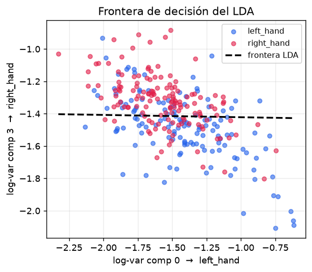

# 4 · LDA — el clasificador lineal que cierra la cadena

> Toda la cadena ha sido lineal: el FIR en el tiempo, el CSP en el espacio. El **LDA** la remata
> con una **frontera de decisión lineal** (un hiperplano) sobre el espacio de log-varianzas.
> Código: `backend/src/bci/models/lda.py`. Página: **Entrenamiento / "El Modelo"**.

---

## 4.1 La idea: una frontera recta

Tras el CSP + log-varianza, cada trial es un **vector de características** `F` (una log-varianza por
componente). El **LDA** (*Análisis Discriminante Lineal*) aprende un **hiperplano** que parte ese
espacio en dos regiones, una por mano. En vivo, clasificar es trivial: mirar **de qué lado** cae el
punto.

Que la frontera sea **lineal** no es un detalle cosmético: es la coherencia del proyecto. Las tres
etapas son operaciones lineales, así que la cadena entera es interpretable de principio a fin —
nada de cajas negras no lineales.

---

## 4.2 El modelo gaussiano de covarianza compartida

El LDA asume que cada clase es una **gaussiana** con su propia media `μ_k` pero una **misma matriz
de covarianza Σ** (compartida). Bajo ese supuesto, la regla de Bayes se reduce a una **función
discriminante lineal** en `x`:

```
δ_k(x) = xᵀ Σ⁻¹ μ_k − ½ μ_kᵀ Σ⁻¹ μ_k + log π_k
```

Se asigna la clase con mayor `δ_k`. La clave: como `Σ` es **común** a las dos clases, los términos
**cuadráticos** en `x` se cancelan al comparar `δ_0` con `δ_1`, y lo que queda es lineal → la
frontera entre clases es un **hiperplano**. (Si cada clase tuviera su propia Σ, la frontera sería
cuadrática — eso sería QDA, que rompería la linealidad del proyecto.)

---

## 4.3 El ajuste, paso a paso

`LDA.fit` (`models/lda.py`) calcula, en forma explícita:

1. **Medias y *priors* por clase** (`μ_k`, `π_k = n_k / n`).
2. **Covarianza compartida** `Σ` (matriz *within-class* / dispersión intra-clase): se suman las
   dispersiones de cada clase `d.T @ d` y se divide por `(n − n_clases)` (estimador insesgado).
3. **Inversa** `Σ⁻¹` con `np.linalg.pinv` (pseudo-inversa, por estabilidad numérica).
4. **Forma lineal explícita** `δ_k(x) = w_kᵀ x + b_k`:
   ```
   coef_      = means_ @ cov_inv_                        (pesos w_k por clase)
   intercept_ = −½ · diag(means_ · cov_inv_ · means_ᵀ) + log(priors_)   (b_k)
   ```

`decision_function` devuelve `δ_k(x)` y `predict` toma el `argmax`. Está implementado a mano para
que la frontera lineal sea **explícita**; los tests verifican que coincide con
`sklearn.LinearDiscriminantAnalysis`.

> **La frontera binaria.** La recta que separa las dos clases es donde `δ_0(x) = δ_1(x)`, es decir
> `(w_0 − w_1)ᵀ x + (b_0 − b_1) = 0`. Definiendo `w = w_0 − w_1` y `b = b_0 − b_1`, la frontera es
> `y = w·F + b = 0`: a un lado `y > 0` (una mano), al otro `y < 0` (la otra). Ese **valor `y`
> firmado** (la proyección sobre el eje discriminante) es justo lo que el streaming usa como
> `disc` para la barra de confianza en vivo ([sección 7](07-streaming-en-vivo.md)).

---

## 4.4 La frontera sobre los datos

Tomando las dos log-varianzas más discriminativas (componentes extremos del CSP), se ve la nube de
la [sección 3](03-csp.md) **con la frontera del LDA dibujada encima**:



La línea discontinua es el hiperplano: separa las dos nubes lo mejor que puede bajo el supuesto
gaussiano. Donde las nubes se solapan están los **errores** que luego cuantifica la matriz de
confusión ([sección 6](06-validacion-resultados.md)).

---

## 4.5 Cómo se representa en la página

En **Entrenamiento / "El Modelo"**, la etapa final de la cadena clásica:

- **Scatter con frontera** (`SeparabilityScatter` + la recta del LDA): la misma nube de
  separabilidad, ahora cortada por la **línea discontinua** de decisión; el texto explica que a un
  lado quedan los trials de una mano y al otro los de la otra.
- **Ecuación `y = w·F + b`**: muestra el nº de características `F` (log-varianzas), los pesos `w` y
  el sesgo `b` reales del modelo; recalca que la frontera es donde `y = 0` (un hiperplano).
- **Diagrama de etapas** (cabecera): FIR → CSP → log-varianza → **LDA**, marcando que esta es la
  pieza de "clasificación".
- Los datos vienen de `GET /api/lda` (pesos, sesgo, nº de características, puntos proyectados),
  también **disk-first** como el resto de payloads offline.

> **Conexión con EEGNet.** La última capa densa (Softmax) de EEGNet cumple exactamente este papel:
> una combinación lineal de las características que la red extrajo, seguida de una decisión. Por eso
> en la pestaña de EEGNet "no hay sección de LDA aparte" — está integrada en la red
> ([sección 5](05-eegnet.md)).

---

**Siguiente:** [5 · EEGNet](05-eegnet.md) — la red que *aprende sola* el equivalente de FIR + CSP +
log-varianza + LDA, como comprobación de la teoría.
