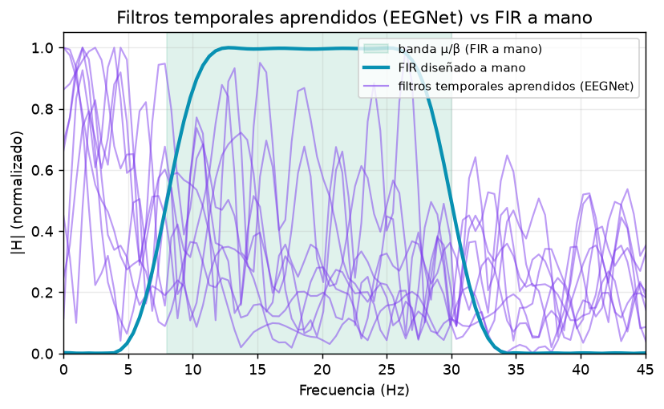
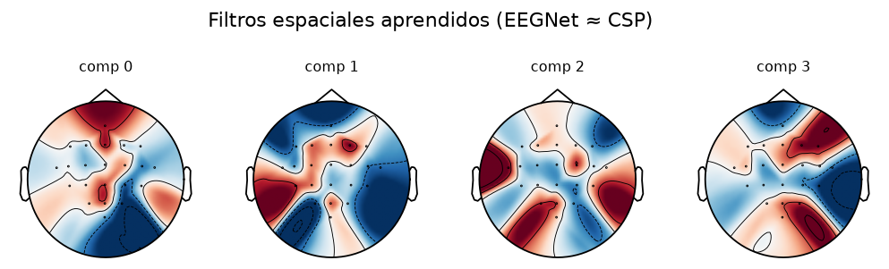

# 5 · EEGNet — el espejo aprendido de la teoría LTI

> La parte de "IA" del proyecto. No es "otro clasificador": es una **comprobación**. Si dejamos que
> una red aprenda sola los filtros, ¿redescubre lo que diseñamos a mano (FIR, CSP)? Código:
> `backend/src/bci/models/eegnet.py`, entrenamiento en `pipeline/training.py`. Página: pestaña
> **EEGNet** dentro de *Entrenamiento / "El Modelo"* (`components/EEGNetModel.tsx`).

---

## 5.1 La idea: las mismas etapas, pero aprendidas

EEGNet (Lawhern et al., 2018) es una red convolucional compacta cuyas capas **imitan el pipeline
LTI clásico**, capa por capa. Es el argumento central de la sección para la defensa:

| Etapa del pipeline clásico | Capa de EEGNet | Qué hace |
|---|---|---|
| **FIR** (banda µ/β) | `Conv2D` temporal `(1 × kern_length)` | un **banco de filtros FIR aprendidos** (cada filtro es una `h[n]` que la red ajusta) |
| **CSP** (`Z = W·X`) | `DepthwiseConv2D` espacial `(C × 1)` | un **filtro espacial aprendido** (combina canales) |
| **log-varianza** | `SeparableConv2D` + `AvgPool` | extracción de **potencia por banda** |
| **LDA** | capa densa + Softmax | el **clasificador lineal** final |

En vez de **diseñar** el FIR y **calcular** el CSP, la red los **descubre por sí misma** a partir de
los datos. Después visualizamos esos filtros aprendidos para ver cuánto se parecen a los nuestros.

---

## 5.2 La arquitectura (qué hace cada bloque)

`EEGNet` (`models/eegnet.py`) recibe la señal como `(batch, 1, n_canales, n_muestras)` y la pasa por:

1. **Bloque temporal** — `Conv2d(1, F1, (1, kern_length))` + BatchNorm. `F1=8` filtros temporales;
   `kern_length ≈ fs/2` (≈ 0,5 s), suficiente para resolver ritmos µ/β. **≈ banco de FIR.**
2. **Bloque espacial** — `Conv2d(F1, F1·D, (n_canales, 1), groups=F1)` (*depthwise*) + BatchNorm +
   ELU + `AvgPool(1,4)` + Dropout. Mezcla todos los canales en una columna. **≈ CSP.**
3. **Bloque separable** — `SeparableConv2D` (depthwise temporal + pointwise) + BatchNorm + ELU +
   `AvgPool(1,8)` + Dropout. **≈ extracción de potencia por banda (log-varianza).**
4. **Clasificador** — `Linear(n_feat, n_classes)` → Softmax. **≈ LDA.**

El wrapper `EEGNetClassifier` ofrece `fit`/`predict`/`predict_proba` al estilo sklearn: estandariza
por canal (media/std del train), entrena con **Adam** + `CrossEntropyLoss`, con `weight_decay` (L2,
filtros más suaves), `dropout` y semilla fija. Usa GPU si hay (`pick_device`), si no CPU.

> **Decisión técnica: a EEGNet se le da la señal en banda AMPLIA.** Mientras CSP+LDA recibe la banda
> µ/β estricta (8–30 Hz), a EEGNet se le pasa solo un pasa-banda amplio **4–40 Hz** (`_eegnet_features`)
> y se le deja **aprender** sus propios filtros dentro de esa banda. Sería trampa imponerle ya la
> banda µ/β: la gracia es ver si la encuentra sola.

> **Cuándo el sesgo LTI rescata al deep learning (caso para la defensa).** La banda de entrada es
> **configurable por dataset** (sección `eegnet` del YAML). En datasets con artefactos fuertes fuera
> de la banda motora (p. ej. Dreyer2023: deriva ocular/lenta en 4–13 Hz), la banda amplia hace que
> EEGNet —libre de aprender lo que sea— se **sobreajuste al artefacto** y colapse, mientras el CSP
> (restringido a potencia de banda) es inmune. Restringir la entrada a β (13–30 Hz) lo rescata
> (verificado: Dreyer S3 0.44 → 0.85, sin dañar 2a). Es decir: **elegir la banda a mano** (sesgo
> inductivo LTI) puede salvar a la red. Ver memoria del proyecto.

---

## 5.3 ¿Redescubre la teoría? Los filtros aprendidos

Tras entrenar, extraemos los pesos de las dos primeras capas y los comparamos con los nuestros.

**Filtros temporales (≈ FIR).** Calculamos la respuesta en frecuencia (DTFT, la misma de la
[sección 2](02-fir-convolucion.md)) de cada filtro temporal aprendido y la superponemos a la del FIR
diseñado a mano:

> **Lectura honesta.** Los filtros aprendidos (morados) **no** son un pasa-banda µ/β limpio como el
> nuestro (azul): son ruidosos y reparten energía por todo el espectro. Es lo esperable — la red
> tiene `F1=8` filtros y libertad total, así que se especializa de formas diversas (algunos sí
> concentran energía en 8–30 Hz, otros captan otras pistas). El mensaje para la defensa no es "la red
> clava el FIR", sino que **descubre estructura útil en una zona compatible con la banda µ/β sin que
> se la impongamos** — y que el filtro diseñado a mano es mucho más interpretable.

**Filtros espaciales (≈ CSP).** Los pesos de la capa *depthwise* se dibujan como topomapas, igual
que los patrones CSP de la [sección 3](03-csp.md):

Varios concentran peso sobre la corteza motora (zonas centrales, C3/C4), con lateralización — el
mismo patrón físico que el CSP encuentra por álgebra, aquí emergido del descenso de gradiente.

---

## 5.4 Cómo se entrena (y por qué es honesto)

`train_eegnet_subject` (`pipeline/training.py`) entrena el modelo que se **guarda y se transmite en
vivo**, con el **mismo split honesto que CSP+LDA**: todas las sesiones menos la última para entrenar,
la última como *held-out* que el modelo **nunca** ve. Reporta dos accuracies:

- **inter-sesión** (train split → held-out): la principal, generalización a otro día.
- **within-subject k-fold**: el mejor caso con todos los datos mezclados (techo con calibración).

> **EEGNet es secundario, pero SÍ se usa en vivo.** Decisión revertida en jun-2026: la pieza central
> sigue siendo el pipeline LTI clásico, pero EEGNet es uno de los regímenes seleccionables en la
> demo, vía `EEGNetStreamSimulator` ([sección 7](07-streaming-en-vivo.md)). La comparación formal
> de rendimiento (¿gana CSP o EEGNet?) está en la [sección 6](06-validacion-resultados.md); el
> resumen de la literatura: en imaginación motora, los métodos clásicos **igualan o superan** al
> deep learning, que solo despega con muchos sujetos (régimen cross-subject).

---

## 5.5 Cómo se representa en la página

En la pestaña **EEGNet** de *Entrenamiento* (`EEGNetModel.tsx`):

- **Diagrama de arquitectura** (`ArchitectureDiagram`): el flujo de EEGNet con su equivalente
  clásico anotado debajo de cada capa (el "efecto espejo": Conv temporal ≈ FIR, etc.).
- **Respuesta en frecuencia de los filtros temporales** aprendidos, con la banda µ/β **sombreada**
  como referencia teórica común — igual que la figura 5.3.
- **Topomapas** de los filtros espaciales aprendidos junto a los patrones CSP, para comparar de un
  vistazo lo aprendido vs. lo calculado.
- **Ficha** con las accuracies honestas (inter-sesión y k-fold) y los datos de entrenamiento.
- Datos vía `GET /api/eegnet` (`build_eegnet_payload`): respuesta en frecuencia de los filtros
  temporales + pesos espaciales + métricas, **disk-first** como el resto de payloads offline.

---

**Siguiente:** [6 · Validación y resultados](06-validacion-resultados.md) — cómo medimos honestamente
(k-fold, inter-sesión, cross-subject) y la comparación de los 4 regímenes.
