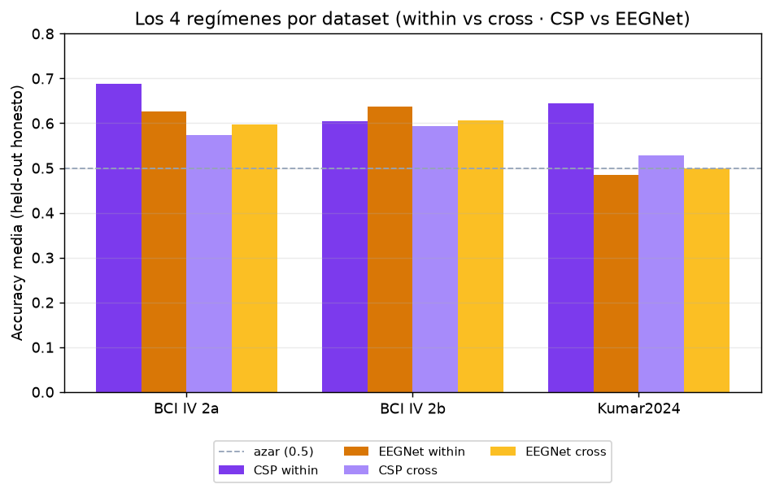

# 6 · Validación y resultados — medir sin engañarse

> La parte menos vistosa y más importante: **cómo medimos** que el sistema funciona sin engañarnos.
> Aquí están la disciplina anti-fuga, las tres formas de validar, los 4 regímenes y las métricas.
> Código: `pipeline/offline.py` (evaluación), `pipeline/training.py` (split honesto),
> `server/results.py` (consolidación). Páginas: **Resultados** (`/results`) y **Benchmark** (`/demo`).

---

## 6.1 El principio: held-out honesto y anti-fuga

La pregunta no es "¿acierta sobre los datos que vio?" (eso es trivial), sino "¿generalizará a señal
**nueva**?". Dos reglas que vertebran todo:

1. **Anti-fuga de datos.** El **CSP** y el **LDA** se ajustan **solo** con la partición de
   entrenamiento de cada split; nunca ven el test. El **FIR** tiene coeficientes fijos (no se
   "entrena"), así que aplicarlo no fuga información. Esto está incrustado en el código: en
   `evaluate_kfold` se crea un `MotorImageryPipeline` nuevo por fold y se hace `fit` solo con `X[tr]`.
2. **Held-out que se transmite en vivo.** El modelo se entrena **antes** del streaming y se reserva
   una partición que **nunca** ve; esa es justo la que se "transmite" en la demo
   ([sección 7](07-streaming-en-vivo.md)). Así la clasificación en vivo evalúa señal jamás vista.

---

## 6.2 Las tres formas de validar

| Validación | Función | Qué estima | Honestidad |
|---|---|---|---|
| **k-fold estratificado** | `evaluate_kfold` | rendimiento mezclando sesiones | optimista (train y test comparten día) |
| **inter-sesión** | `evaluate_by_session` | calibrar en sesión 1, probar en la 2 | **honesta** (otro día → como en vivo) |
| **cross-subject** (LOSO/1-fold) | `train_crosssubject` | ponérselo a una **persona nueva** sin calibrar | la más exigente |

> **Por qué la inter-sesión es la que importa.** Una BCI real se calibra un día y se usa otro. Si
> mezclas sesiones en el k-fold, el modelo "ve el futuro" (la distribución del día de test) y la
> accuracy sale inflada. Por eso el split por defecto (`split_train_demo`) reserva la **última
> sesión** como demo y entrena con todas las demás: estimación honesta inter-sesión, y en datasets de
> varias sesiones (2b=5, Kumar=6) aprovecha todos los datos de entrenamiento.

---

## 6.3 Los 4 regímenes

Cada dataset se evalúa en **cuatro regímenes** = {CSP+LDA, EEGNet} × {within-subject, cross-subject}:

- **within-subject** — el modelo se entrena y prueba en el **mismo** sujeto (calibrado para él).
- **cross-subject** — se entrena con **otros** sujetos y se prueba en uno **nuevo** (sin calibrar);
  el modelo no vio nunca a esa persona (`split_train_demo_subject`).

Lo que se lee en la figura (accuracy media held-out, 3 datasets):

| Régimen | 2a | 2b | Kumar | Lectura |
|---|---|---|---|---|
| CSP within | **0.69** | 0.60 | **0.64** | el clásico calibrado es el más sólido |
| EEGNet within | 0.63 | **0.64** | 0.48 | compite, pero cae con pocos datos (Kumar) |
| CSP cross | 0.57 | 0.59 | 0.53 | CSP es sujeto-específico → baja al cambiar de persona |
| EEGNet cross | 0.60 | 0.61 | 0.50 | aquí el deep learning suele igualar o superar a CSP |

> **El contraste didáctico.** El CSP brilla **within** (sus filtros se ajustan a una anatomía) y se
> resiente **cross** (esa misma especialización no transfiere). EEGNet, entrenado con muchas
> personas, generaliza algo mejor **cross**. Es exactamente el resultado de la literatura: en
> imaginación motora los métodos clásicos **igualan o superan** al deep learning salvo en el régimen
> de muchos sujetos. (Tabla de referencia en la memoria del proyecto.)

---

## 6.4 Las métricas (y por qué cada una)

`pipeline/offline.py` y `server/results.py` calculan, más allá de la accuracy:

| Métrica | Qué añade |
|---|---|
| **Accuracy** | fracción de aciertos (referencia: azar = 0.5 binario) |
| **Kappa de Cohen** | acuerdo corregido por azar: κ=0 es azar, κ=1 perfecto; más justa que la accuracy |
| **Matriz de confusión** | dónde se equivoca (izq↔der), filas=real, col=predicho |
| **Sensitivity / Specificity** | recall por clase (¿sesga hacia una mano?) |
| **ITR** (Wolpaw) | *bits/min*: throughput real de la BCI (balancea precisión, nº de clases y velocidad). Usa `streaming.window_s` |
| **Gini** | desigualdad de rendimiento **entre sujetos** (captura la *BCI illiteracy*: unos rinden alto y otros cerca del azar) |
| **Wilcoxon pareado** | ¿la diferencia CSP vs EEGNet es **significativa**? (p-valor sobre sujetos emparejados) |
| **media ± σ, mediana, min–max** | dispersión honesta, no solo el promedio |

> **Decisión: consolidar, no recalcular.** `server/results.py` **no** re-entrena nada: lee los
> artefactos en disco (`compare_methods_<id>.csv`, fichas `ModelCard`) y los agrega. Así la página
> refleja siempre la última evaluación sin coste. Estados: `measured` (matriz 2×2 completa),
> `partial` (solo within k-fold), `pending` (sin artefactos).

---

## 6.5 Cómo se representa en la página

**Resultados** (`/results`, mundo *offline*) es la vista de **población**:

- **Resumen por dataset** + matriz 2×2 de los 4 regímenes (accuracy y κ).
- **Métricas de comparación y rendimiento**: media ± σ, mediana, rango, ITR, Gini por régimen.
- **Significancia (Wilcoxon)**: el p-valor CSP vs EEGNet, destacado, junto a la tabla de datasets.
- **Dispersión entre sujetos** y scatter de κ por sujeto (se ve la heterogeneidad, no se esconde).
- Datos vía `/api/results` y `/api/results/{dataset}` (consolidados por `results.py`).

**Benchmark** (`/demo`) es la vista **por modelo concreto**: elegido un régimen, muestra la
**matriz de confusión** real del held-out (vía `/api/eval`, que carga el modelo y predice sobre
`idx_demo` sin recalcular) + accuracy y κ de esa ficha. Es el puente entre los números agregados de
Resultados y la demo en vivo de Clasificación.

> **Nota de honestidad (pooled).** Solo el EEGNet *pooled* (LOSO completo) del 2a llegó a entrenarse
> (es el régimen más caro); por eso la ficha pooled solo existe para ese dataset y se decidió **no**
> mostrarla en la web para no sugerir entrenamientos largos que no se repitieron en los demás.

---

**Siguiente:** [7 · Streaming en vivo](07-streaming-en-vivo.md) — el filtrado causal, la ventana
deslizante, la decisión por voto y el detector de reposo.
