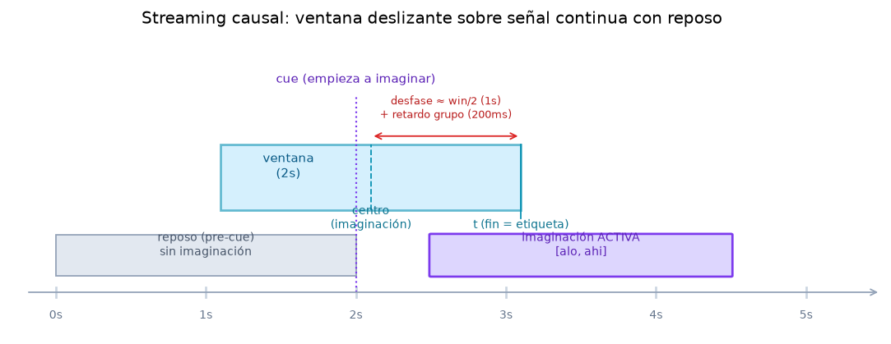

# 7 · Streaming en vivo — causalidad, ventana deslizante y reposo

> El mundo **online**: la señal "llega" como de un casco real y se clasifica ventana a ventana, de
> forma **causal**. Aquí vive la teoría LTI más sutil (filtrado causal con estado, retardo de grupo)
> y el problema honesto del *no-control state*. Código: `streaming/simulator.py`, WebSocket en
> `server/app.py` (`/ws/stream`). Páginas: **Clasificación** (`/live`), **Cerebro 3D** (`/brain`).

---

## 7.1 La diferencia clave: causalidad

Offline filtramos con `mode='same'`, que para calcular `y[n]` usa muestras **futuras** (`x[n+1], …`).
En vivo eso es **imposible**: solo existe el pasado. Un filtro **causal** calcula
`y[n] = Σ_{k≥0} h[k]·x[n−k]` usando solo lo ya recibido.

`CausalFIR` (`simulator.py`) resuelve esto manteniendo un **estado**: un buffer con las últimas
`M−1` muestras de cada canal. Cada chunk nuevo se concatena con ese buffer y se convoluciona con
`mode='valid'` (solo solapamientos completos), de modo que el filtrado **continúa exactamente donde
quedó** el chunk anterior, sin saltos en las fronteras.

> **Propiedad que lo valida (y se testea):** filtrar la señal entera de golpe o por chunks con
> `CausalFIR` da el **resultado idéntico**. Esa equivalencia es lo que garantiza que la simulación es
> fiel a un stream real.

> **El precio: retardo de grupo.** El FIR de fase lineal introduce un retardo de `(M−1)/2` muestras
> (≈ 0,2 s con 101 *taps* a 250 Hz). Offline lo compensábamos con `mode='same'`; **en vivo es real e
> inevitable** — la decisión llega intrínsecamente un poco por detrás de la intención. Es un punto
> didáctico central de la asignatura.

---

## 7.2 La ventana deslizante

`StreamSimulator.stream()` recorre la señal en pasos de `step_s` (0,1 s). Por cada paso:

1. toma un **chunk** de `step` muestras y lo filtra con `CausalFIR` (causal, con estado);
2. lo acumula en un buffer y conserva solo las últimas `window_s` (2 s) → la **ventana deslizante**;
3. cuando la ventana está llena, la clasifica con `pipeline.classify_window()` y emite un *frame*.

Cada *frame* lleva: `t` (tiempo del **fin** de ventana), `pred`, `probs`, `power` (log-varianza por
canal, para "iluminar" el cerebro 3D), y las dos etapas internas — `feat` (vector log-varianza del
CSP) y `disc` (proyección sobre la recta del LDA, frontera en 0) — separadas a propósito para
visualizar la cadena en vivo. EEGNet usa `EEGNetStreamSimulator` (misma mecánica causal, banda
amplia, sin `feat`/`disc`: la UI no dibuja esos paneles para ese método).

---

## 7.3 Por qué la señal cambia *antes* de que el muñeco se mueva

Una pregunta natural al ver la demo: la señal/predicción se mueve **antes** que el muñeco. No es un
bug, es la geometría del streaming (figura 7.2):

- La ventana se **etiqueta por su fin** (`t`), pero la imaginación que contiene está en su **centro**
  (`t − win_s/2`). Con ventana de 2 s, eso es **1 s** de desfase estructural.
- Encima va el **retardo de grupo** del FIR (~0,2 s).
- El **muñeco** demostrativo, en cambio, se mueve según la **verdad de terreno** (`alo`/`ahi`): solo
  durante la franja activa real `[tmin_rel, tmax_rel]`.

Resultado: el clasificador ya "ve" la imaginación (porque su ventana la solapa) ~1 s antes de que el
muñeco —anclado al centro de la franja activa— se active. Es coherente, no contradictorio.

---

## 7.4 Decisión continua, sin conocer las fronteras del trial

Como un casco real, el stream **no sabe** cuándo empieza o acaba la imaginación: la señal incluye los
segundos de **reposo pre-cue** (`demo_baseline_s`, vía `_get_demo_data`, que epoca más ancho). Por
eso el frontend **no** "vota dentro del trial"; decide de forma **continua** (`LiveStream.tsx`):

1. **Suavizado EWMA** de la probabilidad, ventana a ventana, que **no se reinicia** entre trials
   (la señal es continua).
2. **Umbral + abstención**: cuando la confianza suavizada supera el `threshold` (0,65 por defecto),
   se **compromete** con una clase; si no, se **abstiene**.
3. El contador de aciertos compara esos compromisos contra la etiqueta real **solo para puntuar**
   (verdad de terreno), no para decidir.

> **Predicción vs. decisión (lo que se ve en el dashboard).** La **predicción en vivo** es la clase
> de la ventana actual (puede oscilar). La **decisión por voto** agrega los compromisos de la franja
> activa de un trial en una sola respuesta (más estable, más confianza). Por eso una puede marcar 99%
> y la otra 92%: son dos lecturas distintas de la misma señal.

---

## 7.5 El problema honesto del *no-control state* (reposo)

El clasificador es **binario**: solo conoce izquierda y derecha, **no tiene clase "reposo"**. ¿Cómo
sabe que el sujeto no hace nada? La respuesta honesta: **con este modelo, no del todo**. Un LDA es
**sobreconfiado** (proyecta casi cualquier ventana lejos de la frontera), así que durante el reposo
suele comprometerse igual → **falsas alarmas**.

Subir el umbral las reduce pero nunca las elimina (y pierde imaginaciones débiles). Como **paliativo**
está el **detector de reposo** (`_ensure_rest_detector`, B.4): un clasificador lineal extra
(regresión logística sobre la potencia de banda µ/β por canal), **calibrado con las ventanas pre-cue
(reposo) vs. activas del train** (sin tocar el held-out). Actúa de **compuerta**: solo deja decidir
cuando cree que hay imaginación.

> **Honestidad (está en la propia página).** No es gratis ni perfecto: la separabilidad reposo/activo
> es modesta (**AUC ≈ 0,71** en 2a s1). Reduce las falsas alarmas ~a la mitad, pero rechaza también
> algunos trials reales. Antes esto quedaba **oculto** porque solo se puntuaban las ventanas dentro
> de la franja activa conocida; al clasificar de forma continua, la demo **deja ver este límite real**
> de una BCI. El toggle está OFF por defecto; el servidor manda `p_act` (P[activo]) por *frame* (y
> `None` en cross, donde no hay train del sujeto para calibrar).

---

## 7.6 Entrenar / transmitir: solo el held-out

El WebSocket `/ws/stream` reproduce **solo los trials reservados** (`idx_demo`), en bucle: el modelo
**nunca** los vio al entrenar (sección 6). Carga datos y modelo fuera del *event loop* (operaciones
pesadas), aplica el FIR causal + el simulador del método elegido (`_make_sim`), y empuja *frames*
JSON al ritmo `step_s`. Cada frame añade la verdad de terreno (`true`, `alo`, `ahi`) y el progreso
(`demo_i`/`demo_n`) para la barra y la puntuación.

---

## 7.7 Cómo se representa en la página

- **Clasificación** (`/live`): la cadena en vivo en tres paneles explícitos
  (`PipelineStages.tsx`) — señal filtrada → proyección CSP (`feat`) → decisión LDA (`disc`, frontera
  en 0) — más el cartel de decisión continua, el contador de aciertos/falsas alarmas, el muñeco
  (`HandPuppet`), la traza de confianza con la **banda verde** que marca la franja activa, y el
  toggle del detector de reposo.
- **Laboratorio** (`/lab`): la misma señal en vivo, filtrada **en el cliente** (sección 2).
- **Cerebro 3D** (`/brain`): la potencia µ/β por electrodo (`power`) "ilumina" el cuero cabelludo en
  tiempo real (three.js), con barras de lateralización por hemisferio.

El detalle del frontend (estado global, grid, gráficos imperativos) está en la
[sección 8](08-frontend.md).

---

**Siguiente:** [8 · Frontend](08-frontend.md) — la arquitectura de la SPA didáctica que materializa
todo lo anterior.
